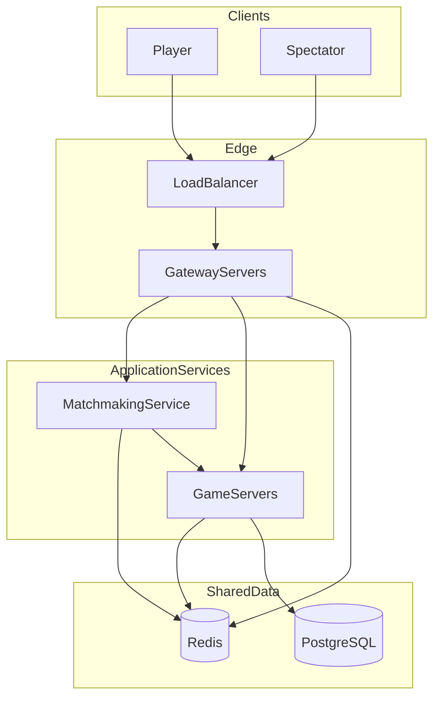
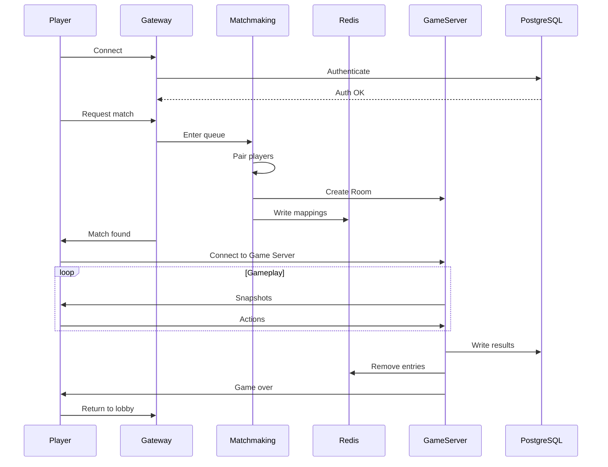

# Kung Fu Chess Multiplayer Server — Cloud Architecture Design

## תקציר

מסמך זה מתאר את ארכיטקטורת הענן היעד עבור שרת הרב-משתתפים של Kung Fu Chess. התכן תומך ב-Horizontal Scaling, High Availability, ו-Matchmaking גלובלי עבור וariant שחמט בזמן אמת, עם סמכות שרת (server-authoritative), ומשחקים קצרים (30–90 שניות).

**קנה מידה יעד:** 100 מיליון משתמשים רשומים, 10 מיליון שחקנים במקביל, Matchmaking גלובלי, ותמיכה בצופים.

**היקף:** ארכיטקטורה, אחריויות, scalability, והחלטות תכן. מסמך זה אינו מסמך יישום.

---

## 1. מבוא

Kung Fu Chess הוא variant שחמט רב-משתתפים בזמן אמת, שבו כלים נעים ברציפות ולא במהלכים דискרטיים. השרת הנוכחי הוא MVP בתהליך יחיד שמטפל בחיבורי WebSocket, אימות, Matchmaking, וסימולציית משחק בלולאה אחת.

הארכיטקטורה הקיימת שומרת על מספר מושגי יסוד שעוברים לתכן הענן:

- **סימולציה עם סמכות שרת (server-authoritative)** — השרת מחזיק באמת המשחק; לקוחות מציגים Snapshots
- **WebSocket** — תעבורה דו-כיוונית בזמן אמת
- **Room מחזיק GameState** — כל משחק פעיל מוכל ב-Room
- **Match עוטף GameState** — Match הוא wrapper צד-שרת סביב לוגיקת המשחק המשותפת

עיצוב הענן משנה רק את **טופולוגיית הפריסה**. מושגי לוגיקת המשחק נשמרים; השירותים מופרדים כך שכל אחד יכול לה scale באופן עצמאי.

| נוכחי (MVP) | יעד |
|---|---|
| תהליך `GameServer` יחיד | Microservices מבוזרים |
| `GameRoom` אחד / `Match` פעיל אחד | Rooms רבים לכל Game Server |
| `WebSocketServer::kMaxClients = 2` | מיליוני חיבורים במקביל |
| Matchmaking מוטמע ב-`GameServer` | Matchmaking Service ייעודי |
| SQLite | PostgreSQL + Redis |
| Snapshots עם סמכות שרת ב-~60 Hz | אותו מודל, עם Horizontal Scaling |

---

## 2. מגבלות הארכיטקטורה הנוכחית

שרת ה-MVP (`GameServer`) מריץ לולאת tick יחידה שמקבלת לקוחות, מעבדת התחברויות, מבצעת Matchmaking, מדמה משחק פעיל אחד, ושומרת תוצאות — הכל בתוך תהליך אחד הקשור ל-localhost.

מגבלות מרכזיות שמונעות scaling ל-production:

- **צוואר בקבוק בתהליך יחיד** — I/O, Matchmaking, סימולציה, ו-persistence מתחרים בלולאה אחת
- **תקרת חיבורים קשיחה** — `kMaxClients = 2` מגביל את השרת למשחק 1v1 אחד בלבד
- **SQLite persistence** — מסד נתונים בקובץ יחיד, ללא clustering או Horizontal write scaling
- **אין שכבת routing** — אין מנגנון לחבר מחדש שחקן לשרת הנכון או להקצות משחקים בין nodes
- **קשירה ל-localhost** — לא מתאים לפריסת production או לגישה גלובלית

מגבלות אלו מקובלות לפיתוח ובדיקות, אך חייבות להיפתר לפני תמיכה במיליוני שחקנים במקביל.

---

## 3. עקרונות תכן

העקרונות הבאים מנחים כל החלטה ארכיטקטונית בתכן זה:

- **הפרדת אחריויות** — כל שירות אחראי על concern אחד: חיבורים, התאמה, סימולציה, או persistence
- **Stateless edge services** — Gateway ו-Matchmaking לא מחזיקים game state; הקיבולת גדלה בהוספת replicas
- **Stateful game simulation** — GameState חי בדיוק Game Server אחד למשך חיי Room
- **Horizontal scalability** — הקיבולת גדלה בהוספת instances של Game Server, לא בהגדלת node יחיד
- **High availability** — אין single point of failure; רכיבים שנכשלו מוחלפים, לא מתוקנים במקום
- **Fail-fast recovery** — משחקים קצרים מעדיפים abort-and-restart על פני state recovery מורכב
- **Loose coupling** — Matchmaking מתנתק לאחר הקצאת Room; שירותים מתקשרים דרך Redis ו-PostgreSQL, לא בקריאות ישירות
- **Single ownership of game state** — Room אחד, Game Server אחד, GameState סמכותי אחד; ללא סנכרון cross-server במהלך משחק
- **הפרדת persistent ו-transient data** — Redis ל-runtime routing; PostgreSQL לרשומות durable

---

## 4. סקירת ארכיטקטורת יעד

המערכת מאורגנת בשכבות: edge (Load Balancer, Gateway), שירותי application (Matchmaking, Game Servers), ומאגרי נתונים משותפים (Redis, PostgreSQL).

```
Clients (Players + Spectators)
        |
        v
   Load Balancer (L4/L7, TLS termination)
        |
        v
   Gateway Servers (stateless, many replicas)
        |
        +------------------+
        v                  v
 Matchmaking Service    Game Servers (many)
        |                  |
        +--------+---------+
                 v
          Shared Services
        Redis  |  PostgreSQL
```



### אחריויות רכיבים

| Component | אחריות | Stateful? |
|---|---|---|
| Load Balancer | TLS, פיזור חיבורים, routing מבוסס health | No |
| Gateway | WebSocket termination, auth, request routing, העברת player→Game Server | No (session refs in Redis) |
| Matchmaking | Queue, pairing, יצירת Room, בחירת Game Server, registration | Minimal |
| Game Server | סימולציית Room, Snapshots, spectator fan-out, in-game messages | Yes (in-memory GameState) |
| Redis | Runtime routing, load metrics, ephemeral session data | Yes (ephemeral) |
| PostgreSQL | Users, credentials, ELO, match history | Yes (durable) |

---

## 5. Gateway Servers

ה-Gateway הוא נקודת הכניסה לכל חיבורי הלקוח. הוא מטפל במחזור חיי החיבור עד לנקודה שבה שחקן מוקצה ל-Game Server.

**אחריויות:**

- קבלה ותחזוקה של חיבורי WebSocket של לקוחות
- אימות שחקנים (אימות credentials או session tokens מול PostgreSQL)
- routing של control messages (login, בקשות Matchmaking, פעולות lobby)
- חיפוש ב-Redis עבור מיפויי `Player → Game Server`
- העברה או redirect של שחקנים ל-Game Server הנכון לאחר Matchmaking

**במפורש אינו:**

- מבצע סימולציית משחק או `GameState` ticks
- מבצע לוגיקת Matchmaking
- מאחסן game state

instances של Gateway הם replicas **Stateless** המוצבים מאחורי Load Balancer. הפניות routing של session מאוחסנות ב-Redis, כך שכל Gateway יכול לשרת כל שחקן. Sticky sessions ב-Load Balancer הם אופציונליים ומשמשים רק לנוחות WebSocket upgrade, לא ל-game state.

לאחר ש-Matchmaking מקצה Room, ה-Gateway מכוון את השחקן להתחבר ל-endpoint של Game Server שהוקצה.

---

## 6. Matchmaking Service

ה-Matchmaking Service אחראי על התאמת שחקנים והקצאת משחקים חדשים ל-Game Servers. הוא פועל גלובלית ותומך בהתאמה מבוססת ELO.

**אחריויות:**

- תחזוקת תור Matchmaking גלובלי
- התאמת שחקנים לפי ELO rating וזמן המתנה בתור
- יצירת Room ID לכל משחק חדש
- בחירת Game Server זמין הטוב ביותר (ראו אסטרטגיות למטה)
- רישום מיפויי Room ושחקנים ב-Redis
- הודעה ל-Gateway וללקוחות שנמצא משחק

**במפורש אינו:**

- משתתף במשחק פעיל לאחר הקצאת Room
- מדמה משחקים או משדר Snapshots

לאחר ש-Room מוקצה ל-Game Server, Matchmaking אינו מעורב עוד במשחק זה.

### אסטרטגיות בחירת שרת

| Strategy | יתרונות | חסרונות |
|---|---|---|
| Least loaded | מאזן CPU ו-room count בין שרתים | דורש load telemetry מדויק |
| Round Robin | פשוט, חלוקה צפויה | מתעלם מהבדלי קיבולת בין שרתים |
| Lowest latency | חוויית שחקן מיטבית למשחקים בזמן אמת | דורש geographic latency probes |
| Geographic region | עמידה ב-data residency, round-trip time נמוך | עלול לגרום לעומס לא אחיד בין אזורים |

**זרימה טיפוסית:** התאמת שחקנים → בחירת Game Server → רישום `RoomID → GameServer` ו-`PlayerID → RoomID` ב-Redis → הודעה ל-Gateway וללקוחות.

---

## 7. Game Servers

כל Game Server הוא Docker container שמריץ משחקים רבים במקביל. הוא הרכיב היחיד שמבצע סימולציית משחק.

**אחריויות:**

- בעלות וסימולציה של כל ה-Rooms שהוקצו לו
- תחזוקת GameState in-memory לכל Room פעיל
- הרצת tick loop (~60 Hz) ושידור Snapshots לשחקנים וצופים מחוברים
- עיבוד פעולות שחקן במשחק (select, move, jump, resign)
- בסיום משחק: כתיבת תוצאות ועדכוני ELO ל-PostgreSQL, הסרת entries מ-Redis

**אילוצים מרכזיים:**

- כל Room שייך לדיוק Game Server אחד
- רק אותו שרת מדמה את המשחק — אין שיתוף game state בין Game Servers במהלך משחק
- שחקנים וצופים מתחברים לאותו Game Server של ה-Room שבו הם משתתפים או צופים
- מודל הבעלות משקף את ה-MVP: `GameRoom` מחזיק `Match`, שעוטף `GameState`

הוספת קיבולת משמעותה פריסת containers נוספים של Game Server, לא הגדלת העומס על שרתים קיימים מעבר למגבלות שנמדדו.

---

## 8. Redis

Redis מאחסן **מידע runtime זמני בלבד**. הוא אינו source of truth לחשבונות משתמשים, credentials, או היסטוריית משחקים.

### דוגמאות למיפויים

| Key Pattern | Value | מטרה |
|---|---|---|
| `room:{id}` | `game_server_id` | Route lookups ל-Game Server הנכון |
| `player:{id}` | `room_id` | מציאת ה-Room שאליו שייך שחקן |
| `player:{id}` | `game_server_endpoint` | Direct connection routing |
| `gameserver:{id}` | `{active_rooms, cpu_load, region}` | Load metrics לבחירת שרת |

### מדוע Redis ולא PostgreSQL לנתוני Runtime

- **מהירות** — קריאות וכתיבות sub-millisecond לנתיבי routing חמים בזמן חיבור
- **תמיכה ב-TTL** — expiration אוטומטי של session entries מיושנים ללא ניקוי ידני
- **סובלנות ל-churn גבוה** — אחסון in-memory מתאים לנתונים שנוצרים ונהרסים תוך שניות (משך משחק)
- **פחות contention** — row-level locking ו-write latency של PostgreSQL לא מתאימים ל-lookups per-connection בקנה מידה של 10M שחקנים במקביל

PostgreSQL נשאר מאגר durable לכל דבר שחייב לשרוד restart של Redis.

---

## 9. PostgreSQL

PostgreSQL מאחסן **מידע persistent בלבד**: נתונים שחייבים לשרוד restarts, crashes, ו-redeployments.

### מדוע SQLite אינו מתאים

ה-MVP הנוכחי משתמש ב-SQLite (`kfc.db`). SQLite מתאים לפיתוח מקומי אך לא יכול לתמוך בארכיטקטורת היעד:

- **מסד נתונים בקובץ יחיד** — כל הכתיבות לקובץ אחד; אין Horizontal write scaling
- **כתיבות concurrent חלשות** — Game Servers רבים שמסיימים משחקים במקביל יתחרו על writer יחיד
- **אין clustering** — אין מנגנון native לפיזור נתונים בין nodes
- **אין replication** — אין High Availability failover מובנה לשכבת persistence
- **מודל single-writer** — לא תואם ל-fleet מבוזר של Game Servers שכותבים תוצאות משחק במקביל

### מדוע PostgreSQL

- **ACID transactions** — עדכוני rating אטומיים יחד עם הוספת רשומת משחק
- **High concurrency** — MVCC מאפשר writers רבים במקביל ללא חסימת readers
- **Replication** — streaming replication ו-read replicas ל-High Availability
- **בגרות תפעולית** — כלי backup, failover, ו-monitoring מוכרים

### נתונים Persistent המאוחסנים

- חשבונות משתמשים ו-credentials מוצפנים
- ELO ratings
- היסטוריית משחקים ותוצאות
- Audit logs

זה ממופה ל-repository pattern הקיים (`PlayerRepository`, `GameRepository`) ב-MVP, עם migration מ-SQLite ל-PostgreSQL.

---

## 10. Docker

כל שירות מרכזי רץ בתוך Docker container משלו, ומספק בידוד, שחזוריות, ופריסה עקבית בין סביבות.

| Container | תפקיד |
|---|---|
| Gateway | חיבור לקוח ו-routing |
| Matchmaking | התאמת שחקנים והקצאת Room |
| Game Server | סימולציית משחק (Rooms רבים per container) |
| Redis | Runtime routing ו-session data |
| PostgreSQL | Persistent user ו-match data |

ה-container של Game Server כולל את לוגיקת המשחק הקיימת. קונפיגורציה מסופקת דרך environment variables: Redis endpoint, PostgreSQL endpoint, region tag, ו-server ID.

כל container חושף health check endpoint לשימוש ב-Kubernetes liveness ו-readiness probes.

---

## 11. Kubernetes

Kubernetes מנהל **תשתית בלבד**. אין לו domain knowledge על Rooms, Players, או חוקי משחק.

**אחריויות:**

- הפעלה ועצירה של containers (pods)
- restart אוטומטי של containers שקרסו
- scaling של deployments של Game Server לפי עומס
- ניטור בריאות דרך liveness ו-readiness probes
- rolling updates ללא downtime
- Service Discovery לתקשורת inter-service (ראו סעיף 12)

**התנהגות scaling:**

- מספר replicas של Game Server הוא **דינמי** — נקבע לפי עומס המערכת (למשל active rooms per pod, CPU utilization)
- Gateway scale באופן עצמאי לפי connection count
- Matchmaking scale באופן עצמאי לפי queue depth

Kubernetes מחליט *כמה* containers רצים; ה-application מחליט *מה* containers אלו עושים.

---

## 12. Service Discovery

Gateway Servers ו-Matchmaking Service חייבים לגלות Game Servers פעילים ב-runtime ללא כתובות hardcoded.

### איך Discovery עובד

- Kubernetes מספק Service Discovery ברמת תשתית — כש-container של Game Server מתחיל ועובר health check, הוא נהיה reachable כ-endpoint ברשת ה-cluster
- Gateway ו-Matchmaking שואלים את שכבת ה-discovery (או registry הנתמך עליה) כדי לקבל את קבוצת endpoints של Game Servers בריאים
- **אין כתובות hardcoded** — אף שירות לא מטמיע IPs או hostnames קבועים של Game Server; כל routing נפתר דינמית

### מחזור חיים

```
New Game Server starts → passes health check → registered in discovery
Matchmaking queries discovery → selects from healthy servers → assigns Room
Game Server crashes → fails health check → removed from discovery
```

- **רישום אוטומטי** — pod חדש של Game Server נהיה discoverable מיד; Matchmaking יכול להקצות Rooms חדשים ללא שינוי קונפיגורציה
- **ביטול רישום אוטומטי** — Game Server שקרס או לא בריא מוסר מ-discovery set; Matchmaking מפסיק לנתב Rooms חדשים אליו

### Discovery מול Load Metrics

Service Discovery ו-Redis משרתים תפקידים משלימים:

- **Discovery** אומר לשירותים *אילו* Game Servers קיימים ובריאים
- **Redis** אומר לשירותים *כמה עמוס* כל Game Server

יחד הם מאפשרים Horizontal Scaling דינמי: ה-fleet יכול לגדול ולהתכווץ ללא קונפיגורציה ידנית, ושרתים חדשים משתלבים מיד בהקצאת Rooms.

---

## 13. Game Lifecycle

להלן תיאור מחזור החיים המלא של משחק בודד, מחיבור שחקן ועד חזרה ל-lobby.

1. שחקן מתחבר ל-Load Balancer → Gateway
2. Gateway מאמת שחקן (PostgreSQL)
3. שחקן נכנס לתור Matchmaking (דרך Gateway → Matchmaking)
4. Matchmaking מתאים שחקנים (מבוסס rating)
5. Matchmaking בוחר Game Server (דרך Service Discovery + load metrics)
6. Room נוצר ב-Game Server שנבחר
7. מיפויי Redis נכתבים (`Room → Game Server`, `Player → Room`)
8. שחקנים מופנים להתחבר ל-Game Server שהוקצה
9. סימולציית משחק רצה (server-authoritative ticks, Snapshots לשחקנים וצופים)
10. Match מסתיים (ניצחון, הפסד, resign, או disconnect)
11. תוצאות ועדכוני ELO נכתבים ל-PostgreSQL; entries של Redis מוסרים
12. שחקנים חוזרים ל-lobby (Gateway)

**פירוק שלבים:** שלבים 1–8 הם setup (פעם למשחק). שלב 9 הוא gameplay פעיל. שלבים 10–12 הם teardown.



---

## 14. Fault Tolerance

הטבלה הבאה מתארת edge cases, את ההשפעה שלהם, ואת התנהגות ההתאוששות.

| Scenario | השפעה | Recovery |
|---|---|---|
| **Game Server crash** | Rooms פעילים באותו שרת אובדים; entries של Redis become stale | Kubernetes מפעיל מחדש את ה-pod; Matchmaking מפסיק להקצות לשרת מת; שחקנים מושפעים חוזרים ל-lobby; משחקים **לא משוחזרים** (ראו Design Decisions) |
| **Redis crash/failover** | Routing lookups נכשלים לזמן קצר; חיבורים חדשים עלולים להתעכב | Redis Sentinel או Cluster failover; Gateways מנסים שוב; אין אובדן persistent data |
| **PostgreSQL crash** | Authentication ו-history writes נכשלים; משחקים פעילים יכולים להמשיך לזמן קצר | Failover ל-replica; rating writes בתהליך מנסים שוב; read replicas משרתים authentication |
| **Docker/container crash** | pod יחיד נהיה unavailable | Kubernetes restart policy; אותה recovery כמו Game Server crash ל-game pods |
| **Heavy traffic spike** | תורי Matchmaking גדלים; latency עולה | HPA מוסיף Game Server pods; Matchmaking משתמש ב-least-loaded selection; Gateway scale horizontally |
| **All Game Servers full** | Matchmaking לא יכול להקצות Rooms חדשים | שחקנים נשארים בתור עם backoff; operations מקבלים alert; Game Server deployment scaled out |
| **Player disconnect** | Game Server מזהה WebSocket close | ניצחון מוענק לשחקן שנשאר (התנהגות MVP קיימת); Redis מנוקה בסיום משחק |
| **Load Balancer failure** | לא ניתן לestablish חיבורים חדשים | Multi-region Load Balancer עם DNS failover; חיבורי WebSocket קיימים ל-Game Server עלולים לשרוד אם כבר established |

בכל scenario, התכן מעדיף **רציפות מערכת** על פני **שימור משחק בודד**. משך משחק קצר הופך game-level recovery למיותר ברוב מקרי הכשל.

---

## 15. Architectural Trade-offs

סעיף זה מסביר *מדוע* הארכיטקטורה שנבחרה נבחרה על פני חלופות. המטרה היא להדגים reasoning ארכיטקטוני, לא רק לתאר את התכן הסופי.

| Trade-off | Chosen | Alternative | Rationale |
|---|---|---|---|
| **Redis vs PostgreSQL for routing** | Redis for runtime mappings | PostgreSQL for all data | Routing lookups בתדירות גבוהה, ephemeral, ו-latency-sensitive; ACID guarantees של PostgreSQL מוסיפים overhead מיותר ל-session state |
| **Stateless Gateway vs sticky sessions** | Stateless Gateway with Redis session refs | Sticky sessions at Load Balancer | Stateless Gateways scale ללא session affinity constraints; Redis מספק routing בלי לקשור שחקן ל-Gateway instance ספציפי |
| **No game recovery after crash** | Abort game, return to lobby | Periodic snapshot/checkpoint to Redis | משחקים נמשכים 30–90 שניות; recovery complexity (state sync, version conflicts, spectator consistency) עולה על עלות restart |
| **One Room per Game Server** | Exclusive ownership, no cross-server sync | Shared game state via message bus | מבטל distributed consistency problems במהלך סימולציה בזמן אמת; GameState tick בתהליך יחיד פשוט ומהיר יותר |
| **Simplicity vs operational complexity** | Microservices with clear boundaries | Monolith with threading | Monolith לא יכול ל-scale ל-10M concurrent; microservices מוסיפים operational overhead אך מאפשרים scaling עצמאי של connection, matching, ו-simulation layers |
| **Horizontal scaling vs sync overhead** | Partition Rooms across servers | Synchronized simulation cluster | Horizontal partitioning נמנע מ-inter-server coordination במהלך gameplay; sync overhead יגדל linearly עם player count |

**Redis מול PostgreSQL:** פיצול runtime data ו-persistent data מונע כפייה על transactional database לטפל במיליוני ephemeral key lookups לשנייה. ה-trade-off הוא מורכבות תפעולית — שני data stores במקום אחד — אך כל אחד מותאם ל-workload שלו.

**ללא game recovery:** למשחקים של 30–90 שניות, ההשפעה על חוויית השחקן מ-restart היא מינימלית. החלופה — Snapshots תקופתיים, טיפול בכתיבות חלקיות, ו-reconciliation של spectator state — תגדיל משמעותית את מורכבות המערכת לתועלת זניחה.

**Room אחד לכל Game Server:** סימולציה בזמן אמת עם collision detection ותנועה רציפה דורשת tick loops הדוקים. פיזור GameState בין שרתים יכניס network latency לנתיב הסימולציה. בעלות בלעדית שומרת על hot path מקומי ומהיר.

---

## 16. Design Decisions

להלן החלטות ספציפיות לפרויקט. ראו סעיף 15 (Architectural Trade-offs) ל-reasoning מאחורי כל החלטה.

- **משחקים פעילים אינם משוחזרים לאחר crash של Game Server** — משחקים נמשכים 30–90 שניות; snapshot recovery נדחה לפורמטים ארוכים יותר בעתיד אם יידרש
- **מודל server-authoritative נשמר** — לקוחות מציגים Snapshots; השרת מחזיק באמת המשחק
- **צופים מתחברים לאותו Game Server** של ה-Room שבו הם צופים, לא ל-Gateway
- **Matchmaking הוא fire-and-forget** — לאחר הקצאת Room, ל-Matchmaking אין תפקיד נוסף במשחק
- **Redis ל-hot path, PostgreSQL ל-cold path** — הפרדת CQRS-lite של transient data ו-durable data

---

## 17. Game Server Capacity

מספר ה-Game Servers הנדרש תלוי במאפייני workload שחייבים להימדד empirically. סעיף זה מתאר את הגורמים המעורבים; הוא **אינו** קובע fleet size קבוע.

### גורמי קיבולת

| Factor | תיאור |
|---|---|
| **CPU** | Simulation tick cost per Room (~60 Hz per active game) |
| **Memory** | In-memory GameState, player sessions, ו-spectator connections per Room |
| **Network bandwidth** | Snapshot fan-out לכל השחקנים והצופים המחוברים |
| **Snapshot generation cost** | Serialization format ו-animation state size |
| **Simulation cost per Room** | Collision detection, move scheduling, real-time arbitration |

### דוגמה — לא דרישת Production

> If a single Game Server can sustain ~N concurrent Rooms (determined by load testing), and the system must support ~M concurrent games, then approximately M/N Game Server instances would be needed — before accounting for redundancy, geographic distribution, and headroom.

ערך N חייב להימדד ב-load testing על חומרה representativית. הארכיטקטורה תומכת בכל N על ידי הוספת instances; אין תקרה ארכיטקטונית על fleet size.

---

## 18. Network Estimation

**הצהרה:** כל המספרים להלן הם הערכות illustrativיות. Bandwidth בפועל תלוי ב-serialization format, snapshot frequency, animation complexity, ו-spectator count. מטרת הניתוח היא להדגים מדוע Horizontal Scaling נדרש, לא לחזות bandwidth מדויק ב-production.

### הנחות

- 10 מיליון שחקנים במקביל במשחקי 1v1 → כ-5 מיליון משחקים במקביל
- ממוצע של ~1 player action כל 2 שניות
- השרת משדר Snapshots ב-~60 Hz (עקבי עם tick rate של MVP הנוכחי)
- Snapshot size משתנה; הפורמט text הנוכחי הוא roughly 0.5–2 KB בהתאם ל-board state ו-animations פעילים
- יחס צופים לא ידוע ומטופל כ-term additive אופציונלי

### ניתוח תעבורה משוער

| Traffic Type | Approx. Rate | Approx. Size | Approx. Bandwidth |
|---|---|---|---|
| Player actions (inbound) | ~2.5M msg/s | ~tens of bytes | ~low hundreds of MB/s |
| Snapshots to players (outbound) | ~600M msg/s | ~0.5–2 KB | ~hundreds of GB/s (order of magnitude) |
| Spectators (optional) | depends on ratio | ~similar to player stream | additive |

### מסקנות

- תעבורת Snapshots outbound מצטברת domina את ה-bandwidth הכולל — snapshot fan-out לשני שחקנים למשחק ב-60 Hz הוא cost driver עיקרי
- שרת יחיד לא יכול לשרת עומס זה — גם compute (מיליוני סימולציות במקביל) וגם network (תעבורה outbound מצטברת) דורשים fleet מבוזר של Game Servers
- שכבת Gateway היא מימד scaling נפרד, מונע על ידי connection count ולא על ידי עלות סימולציה
- fleet sizing מדויק שייך ל-capacity planning ו-load testing, לא למסמך ארכיטקטורה זה

---

## 19. Scalability Summary

| Dimension | Approach |
|---|---|
| **Horizontal Scaling** | הוספת Game Server pods; Gateway ו-Matchmaking scale באופן עצמאי |
| **High Availability** | Multi-replica Stateless services + Redis Cluster + PostgreSQL replication |
| **Future growth** | Regional shards, spectator relay, read replicas ל-leaderboards |

הארכיטקטורה תומכת בצמיחה מ-MVP של משחק יחיד ליעד של 10 מיליון שחקנים במקביל, על ידי הוספת instances בכל שכבה באופן עצמאי, ללא redesign של לוגיקת המשחק המרכזית.

---

## 20. Conclusion

תכן זה מפריד את שרת Kung Fu Chess לשכבות ניתנות ל-scaling עצמאי:

- **Edge (Load Balancer, Gateway)** — מטפל במיליוני חיבורי לקוח ללא domain knowledge על משחק
- **Matchmaking** — מתאים שחקנים גלובלית ומקצה Rooms ל-Game Servers
- **Game Servers** — מדמים משחקים עם בעלות בלעדית על Room ו-Snapshots עם סמכות שרת
- **Shared services (Redis, PostgreSQL)** — מפצלים transient routing data מ-durable user ו-match records

הארכיטקטורה שומרת על מושגי ה-MVP המרכזיים — סימולציה עם סמכות שרת, בעלות Room/GameState, WebSocket transport, ו-snapshot-based synchronization — תוך enablement של Horizontal Scaling, High Availability, ופריסה גלובלית דרך Docker ו-Kubernetes.

המעבר מ-MVP בתהליך יחיד לארכיטקטורת ענן זו אינו דורש שינויים בלוגיקת המשחק. `GameState`, rules engine, ו-snapshot format הקיימים נשארים הבסיס; רק טופולוגיית הפריסה והתשתית התומכת משתנים.

---

## 21. Out of Scope

הנושאים הבאים מוחרגים במכוון ממסמך תכן זה:

- CI/CD pipelines
- Monitoring and observability (metrics, logging, tracing, alerting)
- Cloud-provider-specific services (managed load balancers, CDN, WAF)
- Anti-DDoS infrastructure
- Billing and payment systems
- In-game chat systems
- Database schema details
- Wire protocol message definitions
- Source code implementation

concerns אלו חשובים ל-production deployment, אך נפרדים מהתכן הארכיטקטוני המוצג כאן.
