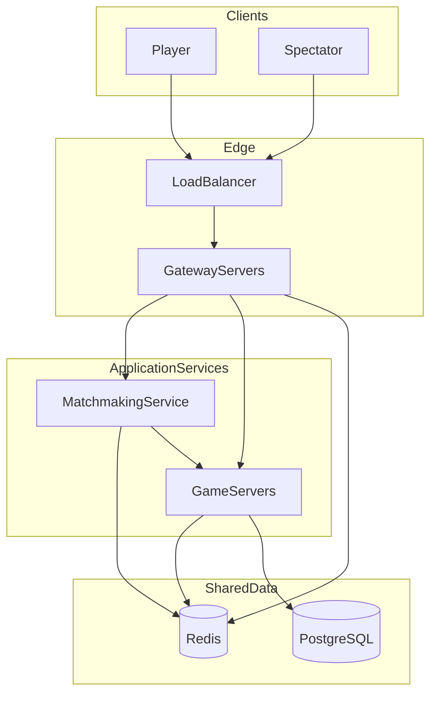
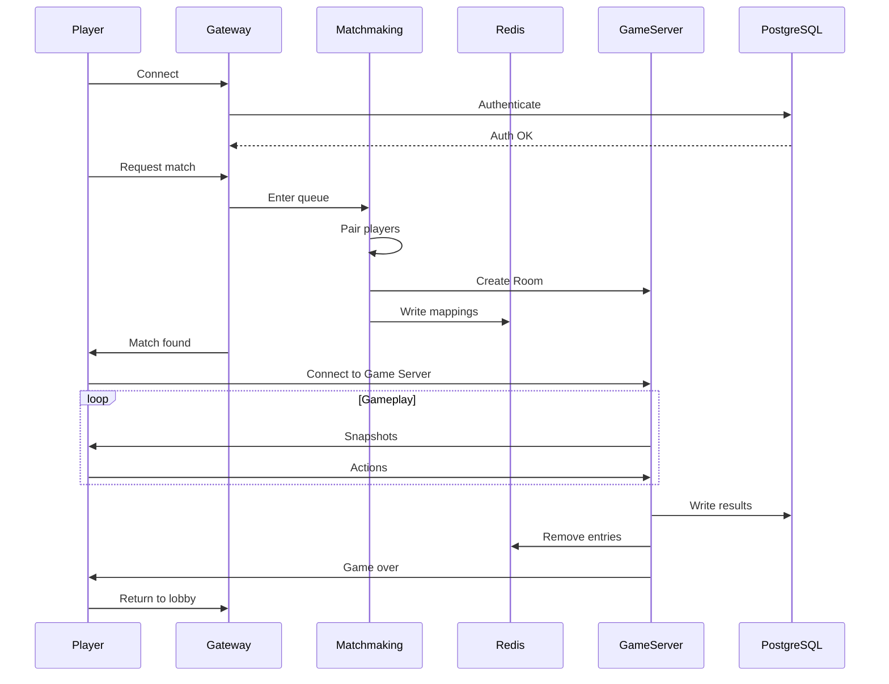

# Kung Fu Chess Multiplayer Server — Cloud Architecture Design

## תקציר

מסמך זה מתאר את ארכיטקטורת הענן היעד עבור שרת הרב-משתתפים של Kung Fu Chess. התכן תומך ב-Horizontal Scaling, High Availability, ו-Matchmaking גלובלי עבור variant שחמט בזמן אמת, עם סמכות שרת (server-authoritative), ומשחקים קצרים (30–90 שניות).

**קנה מידה יעד:** 100 מיליון משתמשים רשומים, 10 מיליון שחקנים במקביל, Matchmaking גלובלי, ותמיכה בצופים.

**היקף:** ארכיטקטורה, אחריויות, scalability, ותשתית. מסמך זה אינו מסמך יישום.

---

## 1. מבוא

Kung Fu Chess הוא variant שחמט רב-משתתפים בזמן אמת, שבו כלים נעים ברציפות ולא במהלכים דискרטיים. השרת הנוכחי הוא MVP בתהליך יחיד שמטפל בחיבורי WebSocket, אימות, Matchmaking, וסימולציית משחק בלולאה אחת.

ארכיטקטורת הענן שומרת על מושגי היסוד הבאים:

- **סימולציה עם סמכות שרת (server-authoritative)** — השרת מחזיק באמת המשחק; לקוחות מציגים Snapshots
- **WebSocket** — תעבורה דו-כיוונית בזמן אמת
- **Room מחזיק GameState** — כל משחק פעיל מוכל ב-Room
- **Match עוטף GameState** — Match הוא wrapper צד-שרת סביב לוגיקת המשחק המשותפת

תכן הענן מפצל מושגים אלו בין שירותים עצמאיים עם טופולוגיית פריסה נפרדת.

| נוכחי (MVP) | יעד |
|---|---|
| תהליך `GameServer` יחיד | Microservices מבוזרים |
| `GameRoom` אחד / `Match` פעיל אחד | Rooms רבים לכל Game Server |
| `WebSocketServer::kMaxClients = 2` | מיליוני חיבורים במקביל |
| Matchmaking מוטמע ב-`GameServer` | Matchmaking Service ייעודי |
| SQLite | PostgreSQL + Redis |
| Snapshots עם סמכות שרת ב-~60 Hz | אותו מודל, עם Horizontal Scaling |

---

## 2. סקירת ארכיטקטורת יעד

המערכת מאורגנת בשכבות: edge (Load Balancer, Gateway), שירותי application (Matchmaking, Game Servers), ומאגרי נתונים משותפים (Redis, PostgreSQL).

```
Clients (Players + Spectators)
        |
        v
   Load Balancer (L4/L7, TLS termination)
        |
        v
   Gateway Servers (stateless, many replicas)
        |
        +------------------+
        v                  v
 Matchmaking Service    Game Servers (many)
        |                  |
        +--------+---------+
                 v
          Shared Services
        Redis  |  PostgreSQL
```



### אחריויות רכיבים

| Component | אחריות | Stateful? |
|---|---|---|
| Load Balancer | TLS, פיזור חיבורים, routing מבוסס health | No |
| Gateway | WebSocket termination, auth, request routing, העברת player→Game Server | No (session refs in Redis) |
| Matchmaking | Queue, pairing, יצירת Room, בחירת Game Server, registration | Minimal |
| Game Server | סימולציית Room, Snapshots, spectator fan-out, in-game messages | Yes (in-memory GameState) |
| Redis | Runtime routing, load metrics, ephemeral session data | Yes (ephemeral) |
| PostgreSQL | Users, credentials, ELO, match history | Yes (durable) |

---

## 3. Gateway Servers

ה-Gateway הוא נקודת הכניסה לכל חיבורי הלקוח. הוא מטפל במחזור חיי החיבור עד לנקודה שבה שחקן מוקצה ל-Game Server.

**אחריויות:**

- קבלה ותחזוקה של חיבורי WebSocket של לקוחות
- אימות שחקנים (אימות credentials או session tokens מול PostgreSQL)
- routing של control messages (login, בקשות Matchmaking, פעולות lobby)
- חיפוש ב-Redis עבור מיפויי `Player → Game Server`
- העברה או redirect של שחקנים ל-Game Server הנכון לאחר Matchmaking

instances של Gateway הם replicas **Stateless** המוצבים מאחורי Load Balancer. הפניות routing של session מאוחסנות ב-Redis, כך שכל Gateway יכול לשרת כל שחקן.

לאחר ש-Matchmaking מקצה Room, ה-Gateway מכוון את השחקן להתחבר ל-endpoint של Game Server שהוקצה.

---

## 4. Matchmaking Service

ה-Matchmaking Service אחראי על התאמת שחקנים והקצאת משחקים חדשים ל-Game Servers. הוא פועל גלובלית ותומך בהתאמה מבוססת ELO.

**אחריויות:**

- תחזוקת תור Matchmaking גלובלי
- התאמת שחקנים לפי ELO rating וזמן המתנה בתור
- יצירת Room ID לכל משחק חדש
- בחירת Game Server זמין
- רישום מיפויי Room ושחקנים ב-Redis
- הודעה ל-Gateway וללקוחות שנמצא משחק

לאחר ש-Room מוקצה ל-Game Server, Matchmaking אינו מעורב עוד במשחק זה.

### אסטרטגיות בחירת שרת

| Strategy | Behavior |
|---|---|
| Least loaded | בוחר את ה-Game Server עם CPU ו-room count הנמוכים ביותר |
| Round Robin | מחלק Rooms ברצף בין שרתים זמינים |
| Lowest latency | בוחר את ה-Game Server עם latency הנמוך ביותר לשחקנים |
| Geographic region | בוחר Game Server באזור הגיאוגרפי של השחקן |

**זרימה טיפוסית:** התאמת שחקנים → בחירת Game Server → רישום `RoomID → GameServer` ו-`PlayerID → RoomID` ב-Redis → הודעה ל-Gateway וללקוחות.

---

## 5. Game Servers

כל Game Server הוא Docker container שמריץ משחקים רבים במקביל. הוא הרכיב היחיד שמבצע סימולציית משחק.

**אחריויות:**

- בעלות וסימולציה של כל ה-Rooms שהוקצו לו
- תחזוקת GameState in-memory לכל Room פעיל
- הרצת tick loop (~60 Hz) ושידור Snapshots לשחקנים וצופים מחוברים
- עיבוד פעולות שחקן במשחק (select, move, jump, resign)
- בסיום משחק: כתיבת תוצאות ועדכוני ELO ל-PostgreSQL, הסרת entries מ-Redis

**אילוצים מרכזיים:**

- כל Room שייך לדיוק Game Server אחד
- רק אותו שרת מדמה את המשחק — אין שיתוף game state בין Game Servers במהלך משחק
- שחקנים וצופים מתחברים לאותו Game Server של ה-Room שבו הם משתתפים או צופים
- כל Room מכיל `Match` אחד, שעוטף `GameState` אחד

---

## 6. Redis

Redis מאחסן **מידע runtime זמני בלבד**.

### דוגמאות למיפויים

| Key Pattern | Value | מטרה |
|---|---|---|
| `room:{id}` | `game_server_id` | Route lookups ל-Game Server הנכון |
| `player:{id}` | `room_id` | מציאת ה-Room שאליו שייך שחקן |
| `player:{id}` | `game_server_endpoint` | Direct connection routing |
| `gameserver:{id}` | `{active_rooms, cpu_load, region}` | Load metrics לבחירת שרת |

---

## 7. PostgreSQL

PostgreSQL מאחסן **מידע persistent בלבד**: נתונים שחייבים לשרוד restarts, crashes, ו-redeployments.

### נתונים Persistent המאוחסנים

- חשבונות משתמשים ו-credentials מוצפנים
- ELO ratings
- היסטוריית משחקים ותוצאות
- Audit logs

---

## 8. Docker

כל שירות מרכזי רץ בתוך Docker container משלו.

| Container | תפקיד |
|---|---|
| Gateway | חיבור לקוח ו-routing |
| Matchmaking | התאמת שחקנים והקצאת Room |
| Game Server | סימולציית משחק (Rooms רבים per container) |
| Redis | Runtime routing ו-session data |
| PostgreSQL | Persistent user ו-match data |

ה-container של Game Server כולל את לוגיקת המשחק הקיימת. קונפיגורציה מסופקת דרך environment variables: Redis endpoint, PostgreSQL endpoint, region tag, ו-server ID.

כל container חושף health check endpoint לשימוש ב-Kubernetes liveness ו-readiness probes.

---

## 9. Kubernetes

Kubernetes מנהל **תשתית בלבד**. אין לו domain knowledge על Rooms, Players, או חוקי משחק.

**אחריויות:**

- הפעלה ועצירה של containers (pods)
- restart אוטומטי של containers שקרסו
- scaling של deployments של Game Server לפי עומס
- ניטור בריאות דרך liveness ו-readiness probes
- rolling updates ללא downtime
- Service Discovery לתקשורת inter-service (ראו סעיף 10)

**התנהגות scaling:**

- מספר replicas של Game Server הוא **דינמי** — נקבע לפי עומס המערכת (למשל active rooms per pod, CPU utilization)
- Gateway scale באופן עצמאי לפי connection count
- Matchmaking scale באופן עצמאי לפי queue depth

---

## 10. Service Discovery

Gateway Servers ו-Matchmaking Service מגלים Game Servers פעילים ב-runtime ללא כתובות hardcoded.

### איך Discovery עובד

- Kubernetes מספק Service Discovery ברמת תשתית — כש-container של Game Server מתחיל ועובר health check, הוא נהיה reachable כ-endpoint ברשת ה-cluster
- Gateway ו-Matchmaking שואלים את שכבת ה-discovery (או registry הנתמך עליה) כדי לקבל את קבוצת endpoints של Game Servers בריאים
- אף שירות לא מטמיע IPs או hostnames קבועים של Game Server; כל routing נפתר דינמית

### מחזור חיים

```
New Game Server starts → passes health check → registered in discovery
Matchmaking queries discovery → selects from healthy servers → assigns Room
Game Server crashes → fails health check → removed from discovery
```

- **רישום אוטומטי** — pod חדש של Game Server נהיה discoverable מיד; Matchmaking יכול להקצות Rooms חדשים
- **ביטול רישום אוטומטי** — Game Server שקרס או לא בריא מוסר מ-discovery set; Matchmaking מפסיק לנתב Rooms חדשים אליו

### Discovery מול Load Metrics

- **Discovery** מזהה אילו Game Servers קיימים ובריאים
- **Redis** מדווח כמה עמוס כל Game Server

---

## 11. Game Lifecycle

להלן תיאור מחזור החיים המלא של משחק בודד, מחיבור שחקן ועד חזרה ל-lobby.

1. שחקן מתחבר ל-Load Balancer → Gateway
2. Gateway מאמת שחקן (PostgreSQL)
3. שחקן נכנס לתור Matchmaking (דרך Gateway → Matchmaking)
4. Matchmaking מתאים שחקנים (מבוסס rating)
5. Matchmaking בוחר Game Server (דרך Service Discovery + load metrics)
6. Room נוצר ב-Game Server שנבחר
7. מיפויי Redis נכתבים (`Room → Game Server`, `Player → Room`)
8. שחקנים מופנים להתחבר ל-Game Server שהוקצה
9. סימולציית משחק רצה (server-authoritative ticks, Snapshots לשחקנים וצופים)
10. Match מסתיים (ניצחון, הפסד, resign, או disconnect)
11. תוצאות ועדכוני ELO נכתבים ל-PostgreSQL; entries של Redis מוסרים
12. שחקנים חוזרים ל-lobby (Gateway)

**פירוק שלבים:** שלבים 1–8 הם setup (פעם למשחק). שלב 9 הוא gameplay פעיל. שלבים 10–12 הם teardown.



---

## 12. Fault Tolerance

הטבלה הבאה מתארת edge cases, את ההשפעה שלהם, ואת התנהגות ההתאוששות.

| Scenario | השפעה | Recovery |
|---|---|---|
| **Game Server crash** | Rooms פעילים באותו שרת אובדים; entries של Redis become stale | Kubernetes מפעיל מחדש את ה-pod; Matchmaking מפסיק להקצות לשרת מת; שחקנים מושפעים חוזרים ל-lobby |
| **Redis crash/failover** | Routing lookups נכשלים לזמן קצר; חיבורים חדשים עלולים להתעכב | Redis Sentinel או Cluster failover; Gateways מנסים שוב |
| **PostgreSQL crash** | Authentication ו-history writes נכשלים; משחקים פעילים יכולים להמשיך לזמן קצר | Failover ל-replica; rating writes בתהליך מנסים שוב; read replicas משרתים authentication |
| **Docker/container crash** | pod יחיד נהיה unavailable | Kubernetes restart policy |
| **Heavy traffic spike** | תורי Matchmaking גדלים; latency עולה | HPA מוסיף Game Server pods; Matchmaking משתמש ב-least-loaded selection; Gateway scale horizontally |
| **All Game Servers full** | Matchmaking לא יכול להקצות Rooms חדשים | שחקנים נשארים בתור עם backoff; Game Server deployment scaled out |
| **Player disconnect** | Game Server מזהה WebSocket close | ניצחון מוענק לשחקן שנשאר; Redis מנוקה בסיום משחק |
| **Load Balancer failure** | לא ניתן לestablish חיבורים חדשים | Multi-region Load Balancer עם DNS failover; חיבורי WebSocket קיימים ל-Game Server עלולים לשרוד אם כבר established |

---

## 13. Game Server Capacity

מספר ה-Game Servers הנדרש תלוי במאפייני workload שנמדדים ב-load testing.

### גורמי קיבולת

| Factor | תיאור |
|---|---|
| **CPU** | Simulation tick cost per Room (~60 Hz per active game) |
| **Memory** | In-memory GameState, player sessions, ו-spectator connections per Room |
| **Network bandwidth** | Snapshot fan-out לכל השחקנים והצופים המחוברים |
| **Snapshot generation cost** | Serialization format ו-animation state size |
| **Simulation cost per Room** | Collision detection, move scheduling, real-time arbitration |

---

## 14. Network Estimation

כל המספרים להלן הם הערכות illustrativיות. Bandwidth בפועל תלוי ב-serialization format, snapshot frequency, animation complexity, ו-spectator count.

### הנחות

- 10 מיליון שחקנים במקביל במשחקי 1v1 → כ-5 מיליון משחקים במקביל
- ממוצע של ~1 player action כל 2 שניות
- השרת משדר Snapshots ב-~60 Hz
- Snapshot size משתנה; הפורמט text הנוכחי הוא roughly 0.5–2 KB בהתאם ל-board state ו-animations פעילים
- יחס צופים לא ידוע ומטופל כ-term additive אופציונלי

### ניתוח תעבורה משוער

| Traffic Type | Approx. Rate | Approx. Size | Approx. Bandwidth |
|---|---|---|---|
| Player actions (inbound) | ~2.5M msg/s | ~tens of bytes | ~low hundreds of MB/s |
| Snapshots to players (outbound) | ~600M msg/s | ~0.5–2 KB | ~hundreds of GB/s (order of magnitude) |
| Spectators (optional) | depends on ratio | ~similar to player stream | additive |

---

## 15. Scalability Summary

| Dimension | Approach |
|---|---|
| **Horizontal Scaling** | הוספת Game Server pods; Gateway ו-Matchmaking scale באופן עצמאי |
| **High Availability** | Multi-replica Stateless services + Redis Cluster + PostgreSQL replication |
| **Future growth** | Regional shards, spectator relay, read replicas ל-leaderboards |

---

## 16. Conclusion

תכן זה מפריד את שרת Kung Fu Chess לשכבות ניתנות ל-scaling עצמאי:

- **Edge (Load Balancer, Gateway)** — מטפל במיליוני חיבורי לקוח
- **Matchmaking** — מתאים שחקנים גלובלית ומקצה Rooms ל-Game Servers
- **Game Servers** — מדמים משחקים עם בעלות בלעדית על Room ו-Snapshots עם סמכות שרת
- **Shared services (Redis, PostgreSQL)** — runtime routing data ו-durable user ו-match records

---

## 17. Out of Scope

הנושאים הבאים מוחרגים ממסמך תכן זה:

- CI/CD pipelines
- Monitoring and observability (metrics, logging, tracing, alerting)
- Cloud-provider-specific services (managed load balancers, CDN, WAF)
- Anti-DDoS infrastructure
- Billing and payment systems
- In-game chat systems
- Database schema details
- Wire protocol message definitions
- Source code implementation
