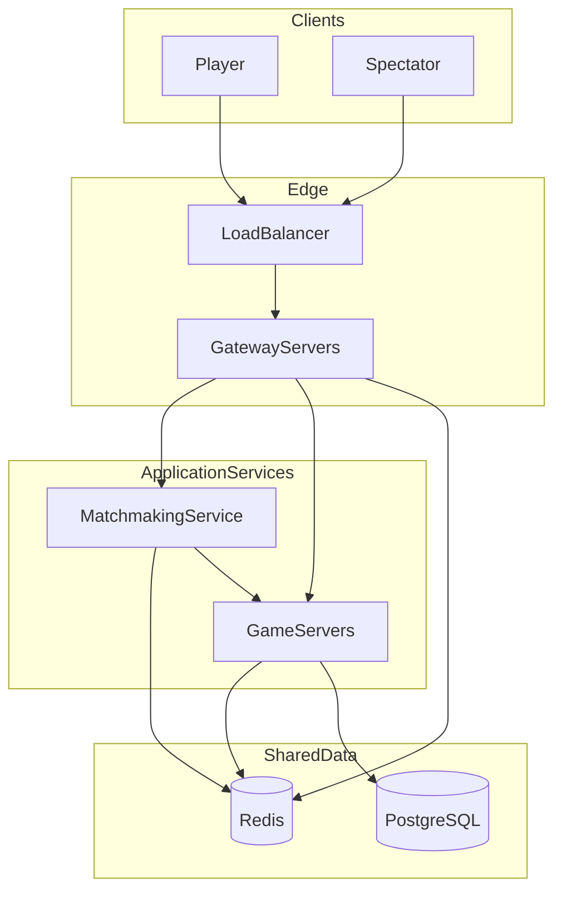
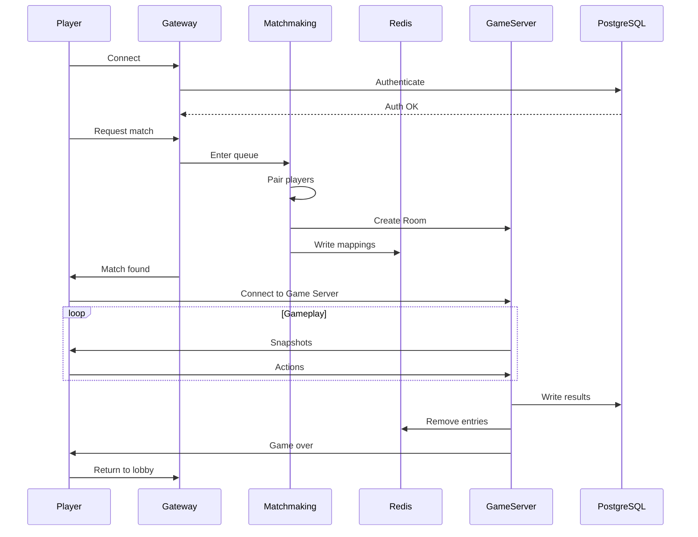

# Kung Fu Chess Multiplayer Server — Cloud Architecture Design

## Abstract

This document describes the target cloud architecture for the Kung Fu Chess multiplayer server. The design supports horizontal scaling, high availability, and global matchmaking for a real-time, server-authoritative chess variant with short match durations (30–90 seconds).

**Target scale:** 100 million registered users, 10 million concurrent players, global matchmaking, and spectator support.

**Scope:** Architecture, responsibilities, scalability, and design decisions. This is not an implementation document.

---

## 1. Introduction

Kung Fu Chess is a real-time multiplayer chess variant where pieces move continuously rather than in discrete turns. The current server is a single-process MVP that handles WebSocket connections, authentication, matchmaking, and game simulation in one loop.

The existing architecture preserves several core concepts that carry forward into the cloud design:

- **Server-authoritative** simulation — the server owns game truth; clients render snapshots
- **WebSocket** transport for real-time bidirectional communication
- **Room owns GameState** — each active game is encapsulated in a Room
- **Match wraps GameState** — a Match is the server-side session wrapper around shared game logic

The cloud redesign changes only the **deployment topology**. Game logic concepts remain intact; services are separated so each can scale independently.

| Current (MVP) | Target |
|---|---|
| Single `GameServer` process | Distributed microservices |
| One `GameRoom` / one active `Match` | Many Rooms per Game Server |
| `WebSocketServer::kMaxClients = 2` | Millions of concurrent connections |
| Matchmaking embedded in `GameServer` | Dedicated Matchmaking Service |
| SQLite | PostgreSQL + Redis |
| Server-authoritative snapshots at ~60 Hz | Same model, horizontally scaled |

---

## 2. Current Architecture Limitations

The MVP server (`GameServer`) runs a single tick loop that accepts clients, processes logins, performs matchmaking, simulates one active game, and persists results — all within one process bound to localhost.

Key limitations that prevent scaling to production:

- **Single-process bottleneck** — I/O, matchmaking, simulation, and persistence compete in one loop
- **Hard connection cap** — `kMaxClients = 2` limits the server to exactly one 1v1 game
- **SQLite persistence** — a single-file database with no clustering or horizontal write scaling
- **No routing layer** — no mechanism to reconnect a player to the correct server or assign games across nodes
- **Localhost binding** — not suitable for production deployment or global access

These constraints are acceptable for development and testing but must be addressed before supporting millions of concurrent players.

---

## 3. Design Principles

The following principles guide every architectural decision in this design:

- **Separation of responsibilities** — each service owns one concern: connections, matching, simulation, or persistence
- **Stateless edge services** — Gateway and Matchmaking hold no game state; capacity grows by adding replicas
- **Stateful game simulation** — GameState lives in exactly one Game Server for the duration of a Room
- **Horizontal scalability** — capacity grows by adding Game Server instances, not by enlarging a single node
- **High availability** — no single point of failure; failed components are replaced, not repaired in place
- **Fail-fast recovery** — short games favor abort-and-restart over complex state recovery
- **Loose coupling** — Matchmaking disengages after room assignment; services communicate through Redis and PostgreSQL, not direct calls
- **Single ownership of game state** — one Room, one Game Server, one authoritative GameState; no cross-server synchronization during play
- **Separation of persistent and transient data** — Redis for runtime routing; PostgreSQL for durable records

---

## 4. Target Architecture Overview

The system is organized into layers: edge (Load Balancer, Gateway), application services (Matchmaking, Game Servers), and shared data stores (Redis, PostgreSQL).

```
Clients (Players + Spectators)
        |
        v
   Load Balancer (L4/L7, TLS termination)
        |
        v
   Gateway Servers (stateless, many replicas)
        |
        +------------------+
        v                  v
 Matchmaking Service    Game Servers (many)
        |                  |
        +--------+---------+
                 v
          Shared Services
        Redis  |  PostgreSQL
```



### Component Responsibilities

| Component | Responsibility | Stateful? |
|---|---|---|
| Load Balancer | TLS, connection distribution, health-based routing | No |
| Gateway | WebSocket termination, auth, request routing, player→Game Server forwarding | No (session refs in Redis) |
| Matchmaking | Queue, pairing, room creation, Game Server selection, registration | Minimal |
| Game Server | Room simulation, snapshots, spectator fan-out, in-game messages | Yes (in-memory GameState) |
| Redis | Runtime routing, load metrics, ephemeral session data | Yes (ephemeral) |
| PostgreSQL | Users, credentials, ELO, match history | Yes (durable) |

---

## 5. Gateway Servers

The Gateway is the entry point for all client connections. It handles the connection lifecycle up to the point where a player is assigned to a Game Server.

**Responsibilities:**

- Receive and maintain client WebSocket connections
- Authenticate players (validate credentials or session tokens against PostgreSQL)
- Route control messages (login, matchmaking requests, lobby actions)
- Look up Redis for `Player → Game Server` mappings
- Forward or redirect players to the correct Game Server after matchmaking

**Explicitly does NOT:**

- Execute game simulation or `GameState` ticks
- Perform matchmaking logic
- Store game state

Gateway instances are **Stateless** replicas deployed behind the Load Balancer. Session routing references are stored in Redis, so any Gateway can serve any player. Sticky sessions at the Load Balancer are optional and used only for WebSocket upgrade convenience, not for game state.

Once Matchmaking assigns a Room, the Gateway directs the player to connect to the assigned Game Server endpoint.

---

## 6. Matchmaking Service

The Matchmaking Service is responsible for pairing players and assigning new games to Game Servers. It operates globally and supports rating-based pairing.

**Responsibilities:**

- Maintain a global matchmaking queue
- Pair players based on ELO rating and queue time
- Create a Room ID for each new match
- Select the best available Game Server (see strategies below)
- Register Room and player mappings in Redis
- Notify Gateway and clients that a match has been found

**Explicitly does NOT:**

- Participate in active gameplay after room assignment
- Simulate games or broadcast snapshots

Once a Room is assigned to a Game Server, Matchmaking is no longer involved in that game.

### Server Selection Strategies

| Strategy | Pros | Cons |
|---|---|---|
| Least loaded | Balances CPU and room count across servers | Requires accurate load telemetry |
| Round Robin | Simple, predictable distribution | Ignores capacity differences between servers |
| Lowest latency | Best player experience for real-time games | Requires geographic latency probes |
| Geographic region | Data residency compliance, low round-trip time | Can cause uneven load across regions |

**Typical flow:** pair players → select Game Server → register `RoomID → GameServer` and `PlayerID → RoomID` in Redis → notify Gateway and clients.

---

## 7. Game Servers

Each Game Server is a Docker container that runs many concurrent games simultaneously. It is the only component that executes game simulation.

**Responsibilities:**

- Own and simulate all Rooms assigned to it
- Maintain in-memory GameState for each active Room
- Run the tick loop (~60 Hz) and broadcast snapshots to connected players and spectators
- Process in-game player actions (select, move, jump, resign)
- On game end: write results and ELO updates to PostgreSQL, remove Redis entries

**Key constraints:**

- Each Room belongs to exactly one Game Server
- Only that server simulates the game — no game state is shared between Game Servers during gameplay
- Players and spectators connect to the same Game Server as the Room they participate in or watch
- The ownership model mirrors the current MVP: `GameRoom` holds a `Match`, which wraps `GameState`

Adding capacity means deploying more Game Server containers, not increasing the load on existing ones beyond their measured limits.

---

## 8. Redis

Redis stores **temporary runtime information only**. It is not the source of truth for user accounts, credentials, or match history.

### Example Mappings

| Key Pattern | Value | Purpose |
|---|---|---|
| `room:{id}` | `game_server_id` | Route lookups to the correct Game Server |
| `player:{id}` | `room_id` | Find which Room a player belongs to |
| `player:{id}` | `game_server_endpoint` | Direct connection routing |
| `gameserver:{id}` | `{active_rooms, cpu_load, region}` | Load metrics for server selection |

### Why Redis Instead of PostgreSQL for Runtime Data

- **Speed** — sub-millisecond reads and writes for hot routing paths at connection time
- **TTL support** — automatic expiration of stale session entries without manual cleanup
- **High churn tolerance** — in-memory storage suits data that is created and destroyed within seconds (match duration)
- **Reduced contention** — PostgreSQL row-level locking and write latency are unsuitable for per-connection lookups at 10M concurrent player scale

PostgreSQL remains the durable store for anything that must survive a Redis restart.

---

## 9. PostgreSQL

PostgreSQL stores **persistent information only**: data that must survive server restarts, crashes, and redeployments.

### Why SQLite Is Not Suitable

The current MVP uses SQLite (`kfc.db`). SQLite is appropriate for local development but cannot support the target architecture:

- **Single-file database** — all writes go to one file; no horizontal write scaling
- **Poor concurrent writes** — many Game Servers finishing games simultaneously would contend on a single writer
- **No clustering** — no native mechanism to distribute data across nodes
- **No replication** — no built-in high-availability failover for the persistence layer
- **Single-writer model** — incompatible with a distributed fleet of Game Servers writing match results in parallel

### Why PostgreSQL

- **ACID transactions** — atomic rating updates combined with match record insertion
- **High concurrency** — MVCC allows many simultaneous writers without blocking readers
- **Replication** — streaming replication and read replicas for high availability
- **Operational maturity** — well-understood backup, failover, and monitoring tooling

### Persistent Data Stored

- User accounts and hashed credentials
- ELO ratings
- Match history and results
- Audit logs

This maps to the existing repository pattern (`PlayerRepository`, `GameRepository`) used in the MVP, migrated from SQLite to PostgreSQL.

---

## 10. Docker

Each major service runs inside its own Docker container, providing isolation, reproducibility, and consistent deployment across environments.

| Container | Role |
|---|---|
| Gateway | Client connection and routing |
| Matchmaking | Player pairing and Room assignment |
| Game Server | Game simulation (many Rooms per container) |
| Redis | Runtime routing and session data |
| PostgreSQL | Persistent user and match data |

The Game Server container bundles the existing server game logic. Configuration is provided through environment variables: Redis endpoint, PostgreSQL endpoint, region tag, and server ID.

Each container exposes a health check endpoint used by Kubernetes liveness and readiness probes.

---

## 11. Kubernetes

Kubernetes manages **infrastructure only**. It has no domain knowledge of Rooms, Players, or game rules.

**Responsibilities:**

- Start and stop containers (pods)
- Restart crashed containers automatically
- Scale Game Server deployments based on load
- Monitor health via liveness and readiness probes
- Perform rolling updates without downtime
- Provide Service Discovery for inter-service communication (see Section 12)

**Scaling behavior:**

- Game Server replica count is **dynamic** — determined by system load (e.g., active rooms per pod, CPU utilization)
- Gateway scales independently based on connection count
- Matchmaking scales independently based on queue depth

Kubernetes decides *how many* containers run; the application decides *what* those containers do.

---

## 12. Service Discovery

Gateway Servers and the Matchmaking Service must discover active Game Servers at runtime without hardcoded addresses.

### How Discovery Works

- Kubernetes provides infrastructure-level Service Discovery — when a Game Server container starts and passes its health check, it becomes reachable as an endpoint within the cluster network
- Gateway and Matchmaking query this discovery layer (or a registry backed by it) to obtain the current set of healthy Game Server endpoints
- **No hardcoded addresses** — no service embeds fixed Game Server IPs or hostnames; all routing resolves dynamically

### Lifecycle

```
New Game Server starts → passes health check → registered in discovery
Matchmaking queries discovery → selects from healthy servers → assigns Room
Game Server crashes → fails health check → removed from discovery
```

- **Automatic registration** — a newly scaled-up Game Server pod becomes discoverable immediately; Matchmaking can assign new Rooms to it without configuration changes
- **Automatic deregistration** — a crashed or unhealthy Game Server is removed from the discovery set; Matchmaking stops routing new Rooms to it

### Discovery vs. Load Metrics

Service Discovery and Redis serve complementary roles:

- **Discovery** tells services *which* Game Servers exist and are healthy
- **Redis** tells services *how loaded* each Game Server is

Together they enable dynamic horizontal scaling: the fleet can grow and shrink without manual configuration, and new servers immediately participate in Room assignment.

---

## 13. Game Lifecycle

The following describes the complete lifecycle of a single game, from player connection to return to lobby.

1. Player connects to Load Balancer → Gateway
2. Gateway authenticates player (PostgreSQL)
3. Player enters matchmaking queue (via Gateway → Matchmaking)
4. Matchmaking pairs players (rating-based)
5. Matchmaking selects a Game Server (via Service Discovery + load metrics)
6. Room is created on the selected Game Server
7. Redis mappings are written (`Room → Game Server`, `Player → Room`)
8. Players are directed to connect to the assigned Game Server
9. Game simulation runs (server-authoritative ticks, snapshots to players and spectators)
10. Match ends (win, loss, resign, or disconnect)
11. Results and ELO updates written to PostgreSQL; Redis entries removed
12. Players return to lobby (Gateway)

**Phase breakdown:** Steps 1–8 are setup (once per match). Step 9 is active gameplay. Steps 10–12 are teardown.



---

## 14. Fault Tolerance

The following table describes edge cases, their impact, and recovery behavior.

| Scenario | Impact | Recovery |
|---|---|---|
| **Game Server crash** | Active Rooms on that server are lost; Redis entries become stale | Kubernetes restarts the pod; Matchmaking stops assigning to the dead server; affected players are returned to lobby; games are **not restored** (see Design Decisions) |
| **Redis crash/failover** | Routing lookups fail briefly; new connections may be delayed | Redis Sentinel or Cluster failover; Gateways retry lookups; no persistent data is lost |
| **PostgreSQL crash** | Authentication and history writes fail; active games can continue briefly | Failover to replica; in-flight rating writes are retried; read replicas serve authentication |
| **Docker/container crash** | Single pod becomes unavailable | Kubernetes restart policy; same recovery as Game Server crash for game pods |
| **Heavy traffic spike** | Matchmaking queues grow; latency increases | HPA adds Game Server pods; Matchmaking uses least-loaded selection; Gateway scales horizontally |
| **All Game Servers full** | Matchmaking cannot assign new Rooms | Players remain queued with backoff; operations alerted; Game Server deployment scaled out |
| **Player disconnect** | Game Server detects WebSocket close | Win awarded to remaining player (existing MVP behavior); Redis cleaned up on game end |
| **Load Balancer failure** | New connections cannot be established | Multi-region Load Balancer with DNS failover; existing Game Server WebSocket connections may survive if already established |

For each scenario, the design prioritizes **system continuity** over **individual game preservation**. Short match durations make game-level recovery unnecessary in most failure cases.

---

## 15. Architectural Trade-offs

This section explains *why* the chosen architecture was selected over alternatives. The goal is to demonstrate architectural reasoning, not merely describe the final design.

| Trade-off | Chosen | Alternative | Rationale |
|---|---|---|---|
| **Redis vs PostgreSQL for routing** | Redis for runtime mappings | PostgreSQL for all data | Routing lookups are high-frequency, ephemeral, and latency-sensitive; PostgreSQL ACID guarantees add unnecessary overhead for session state |
| **Stateless Gateway vs sticky sessions** | Stateless Gateway with Redis session refs | Sticky sessions at Load Balancer | Stateless Gateways scale without session affinity constraints; Redis provides routing without tying a player to a specific Gateway instance |
| **No game recovery after crash** | Abort game, return to lobby | Periodic snapshot/checkpoint to Redis | Games last 30–90 seconds; recovery complexity (state sync, version conflicts, spectator consistency) exceeds the cost of restarting |
| **One Room per Game Server** | Exclusive ownership, no cross-server sync | Shared game state via message bus | Eliminates distributed consistency problems during real-time simulation; a single-process GameState tick is simpler and faster |
| **Simplicity vs operational complexity** | Microservices with clear boundaries | Monolith with threading | A monolith cannot scale to 10M concurrent; microservices add operational overhead but enable independent scaling of connection, matching, and simulation layers |
| **Horizontal scaling vs sync overhead** | Partition Rooms across servers | Synchronized simulation cluster | Horizontal partitioning avoids inter-server coordination during gameplay; synchronization overhead would grow linearly with player count |

**Redis vs PostgreSQL:** Splitting runtime and persistent data avoids forcing a transactional database to handle millions of ephemeral key lookups per second. The trade-off is operational complexity — two data stores instead of one — but each is optimized for its workload.

**No game recovery:** For 30–90 second games, the player experience impact of restarting is minimal. The alternative — maintaining periodic snapshots, handling partial writes, and reconciling spectator state — would significantly increase system complexity for negligible benefit.

**One Room per Game Server:** Real-time simulation with collision detection and continuous movement requires tight tick loops. Distributing GameState across servers would introduce network latency into the simulation path. Exclusive ownership keeps the hot path local and fast.

---

## 16. Design Decisions

The following are project-specific decisions. See Section 15 (Architectural Trade-offs) for the reasoning behind each.

- **Active games are NOT restored after a Game Server crash** — games last 30–90 seconds; snapshot recovery is deferred to future longer game formats if needed
- **Server-authoritative model is retained** — clients render snapshots; the server owns game truth
- **Spectators connect to the same Game Server** as the Room they watch, not to the Gateway
- **Matchmaking is fire-and-forget** — once a Room is assigned, Matchmaking has no further role in that game
- **Redis for hot path, PostgreSQL for cold path** — a CQRS-lite separation of transient and durable data

---

## 17. Game Server Capacity

The number of Game Servers required depends on workload characteristics that must be measured empirically. This section describes the factors involved; it does **not** prescribe a fixed fleet size.

### Capacity Factors

| Factor | Description |
|---|---|
| **CPU** | Simulation tick cost per Room (~60 Hz per active game) |
| **Memory** | In-memory GameState, player sessions, and spectator connections per Room |
| **Network bandwidth** | Snapshot fan-out to all connected players and spectators |
| **Snapshot generation cost** | Serialization format and animation state size |
| **Simulation cost per Room** | Collision detection, move scheduling, real-time arbitration |

### Example — Not a Production Requirement

> If a single Game Server can sustain ~N concurrent Rooms (determined by load testing), and the system must support ~M concurrent games, then approximately M/N Game Server instances would be needed — before accounting for redundancy, geographic distribution, and headroom.

The value of N must be measured through load testing on representative hardware. The architecture supports any N by adding instances; there is no architectural ceiling on fleet size.

---

## 18. Network Estimation

**Disclaimer:** All figures below are illustrative estimates. Actual bandwidth depends on serialization format, snapshot frequency, animation complexity, and spectator count. The purpose of this analysis is to demonstrate why horizontal scaling is necessary, not to predict exact production bandwidth.

### Assumptions

- 10 million concurrent players in 1v1 matches → approximately 5 million concurrent games
- Average of ~1 player action every 2 seconds
- Server broadcasts snapshots at ~60 Hz (consistent with current MVP tick rate)
- Snapshot size is variable; the current text format is roughly 0.5–2 KB depending on board state and active animations
- Spectator ratio is unknown and treated as an optional additive term

### Approximate Traffic Analysis

| Traffic Type | Approx. Rate | Approx. Size | Approx. Bandwidth |
|---|---|---|---|
| Player actions (inbound) | ~2.5M msg/s | ~tens of bytes | ~low hundreds of MB/s |
| Snapshots to players (outbound) | ~600M msg/s | ~0.5–2 KB | ~hundreds of GB/s (order of magnitude) |
| Spectators (optional) | depends on ratio | ~similar to player stream | additive |

### Conclusions

- Aggregate outbound snapshot traffic dominates total bandwidth — snapshot fan-out to two players per game at 60 Hz is the primary cost driver
- A single server cannot serve this load — both compute (millions of concurrent simulations) and network (aggregate outbound traffic) require a distributed fleet of Game Servers
- The Gateway layer is a separate scaling dimension, driven by connection count rather than simulation cost
- Exact fleet sizing belongs in capacity planning and load testing, not in this architecture document

---

## 19. Scalability Summary

| Dimension | Approach |
|---|---|
| **Horizontal Scaling** | Add Game Server pods; Gateway and Matchmaking scale independently |
| **High Availability** | Multi-replica Stateless services + Redis Cluster + PostgreSQL replication |
| **Future growth** | Regional shards, spectator relay, read replicas for leaderboards |

The architecture supports growth from the current single-game MVP to the target of 10 million concurrent players by adding instances at each layer independently, without redesigning the core game logic.

---

## 20. Conclusion

This design separates the Kung Fu Chess server into distinct, independently scalable layers:

- **Edge (Load Balancer, Gateway)** — handles millions of client connections without game knowledge
- **Matchmaking** — pairs players globally and assigns Rooms to Game Servers
- **Game Servers** — simulate games with exclusive Room ownership and server-authoritative snapshots
- **Shared services (Redis, PostgreSQL)** — split transient routing data from durable user and match records

The architecture preserves the core MVP concepts — server-authoritative simulation, Room/GameState ownership, WebSocket transport, and snapshot-based synchronization — while enabling horizontal scaling, high availability, and global deployment through Docker and Kubernetes.

The path from the current single-process MVP to this cloud architecture requires no changes to game logic. The existing `GameState`, rules engine, and snapshot format remain the foundation; only the deployment topology and supporting infrastructure change.

---

## 21. Out of Scope

The following topics are intentionally excluded from this design document:

- CI/CD pipelines
- Monitoring and observability (metrics, logging, tracing, alerting)
- Cloud-provider-specific services (managed load balancers, CDN, WAF)
- Anti-DDoS infrastructure
- Billing and payment systems
- In-game chat systems
- Database schema details
- Wire protocol message definitions
- Source code implementation

These concerns are important for production deployment but are separate from the architectural design presented here.
