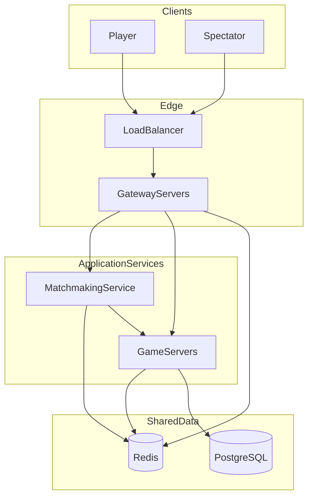
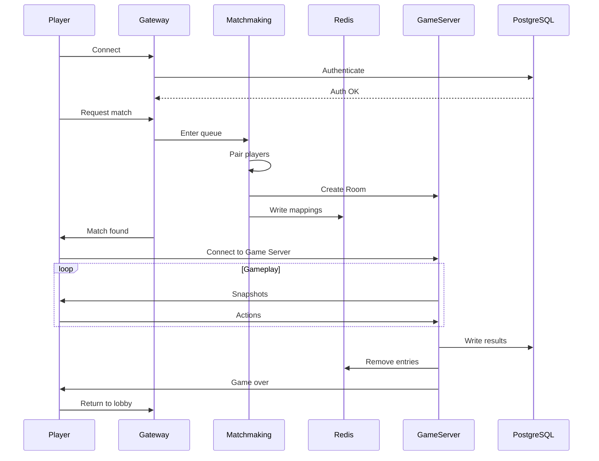

# Kung Fu Chess Multiplayer Server — Cloud Architecture Design

## Abstract

This document describes the target cloud architecture for the Kung Fu Chess multiplayer server. The design supports horizontal scaling, high availability, and global matchmaking for a real-time, server-authoritative chess variant with short match durations (30–90 seconds).

**Target scale:** 100 million registered users, 10 million concurrent players, global matchmaking, and spectator support.

**Scope:** Architecture, responsibilities, scalability, and infrastructure. This is not an implementation document.

---

## 1. Introduction

Kung Fu Chess is a real-time multiplayer chess variant where pieces move continuously rather than in discrete turns. The current server is a single-process MVP that handles WebSocket connections, authentication, matchmaking, and game simulation in one loop.

The cloud architecture preserves the following core concepts:

- **Server-authoritative** simulation — the server owns game truth; clients render snapshots
- **WebSocket** transport for real-time bidirectional communication
- **Room owns GameState** — each active game is encapsulated in a Room
- **Match wraps GameState** — a Match is the server-side session wrapper around shared game logic

The cloud design separates these concepts across independent services with distinct deployment topology.

| Current (MVP) | Target |
|---|---|
| Single `GameServer` process | Distributed microservices |
| One `GameRoom` / one active `Match` | Many Rooms per Game Server |
| `WebSocketServer::kMaxClients = 2` | Millions of concurrent connections |
| Matchmaking embedded in `GameServer` | Dedicated Matchmaking Service |
| SQLite | PostgreSQL + Redis |
| Server-authoritative snapshots at ~60 Hz | Same model, horizontally scaled |

---

## 2. Target Architecture Overview

The system is organized into layers: edge (Load Balancer, Gateway), application services (Matchmaking, Game Servers), and shared data stores (Redis, PostgreSQL).

```
Clients (Players + Spectators)
        |
        v
   Load Balancer (L4/L7, TLS termination)
        |
        v
   Gateway Servers (stateless, many replicas)
        |
        +------------------+
        v                  v
 Matchmaking Service    Game Servers (many)
        |                  |
        +--------+---------+
                 v
          Shared Services
        Redis  |  PostgreSQL
```



### Component Responsibilities

| Component | Responsibility | Stateful? |
|---|---|---|
| Load Balancer | TLS, connection distribution, health-based routing | No |
| Gateway | WebSocket termination, auth, request routing, player→Game Server forwarding | No (session refs in Redis) |
| Matchmaking | Queue, pairing, room creation, Game Server selection, registration | Minimal |
| Game Server | Room simulation, snapshots, spectator fan-out, in-game messages | Yes (in-memory GameState) |
| Redis | Runtime routing, load metrics, ephemeral session data | Yes (ephemeral) |
| PostgreSQL | Users, credentials, ELO, match history | Yes (durable) |

---

## 3. Gateway Servers

The Gateway is the entry point for all client connections. It handles the connection lifecycle up to the point where a player is assigned to a Game Server.

**Responsibilities:**

- Receive and maintain client WebSocket connections
- Authenticate players (validate credentials or session tokens against PostgreSQL)
- Route control messages (login, matchmaking requests, lobby actions)
- Look up Redis for `Player → Game Server` mappings
- Forward or redirect players to the correct Game Server after matchmaking

Gateway instances are **Stateless** replicas deployed behind the Load Balancer. Session routing references are stored in Redis, so any Gateway can serve any player.

Once Matchmaking assigns a Room, the Gateway directs the player to connect to the assigned Game Server endpoint.

---

## 4. Matchmaking Service

The Matchmaking Service is responsible for pairing players and assigning new games to Game Servers. It operates globally and supports rating-based pairing.

**Responsibilities:**

- Maintain a global matchmaking queue
- Pair players based on ELO rating and queue time
- Create a Room ID for each new match
- Select an available Game Server
- Register Room and player mappings in Redis
- Notify Gateway and clients that a match has been found

Once a Room is assigned to a Game Server, Matchmaking is no longer involved in that game.

### Server Selection Strategies

| Strategy | Behavior |
|---|---|
| Least loaded | Selects the Game Server with the lowest CPU and room count |
| Round Robin | Distributes Rooms sequentially across available servers |
| Lowest latency | Selects the Game Server with the lowest measured latency to the players |
| Geographic region | Selects a Game Server in the player's geographic region |

**Typical flow:** pair players → select Game Server → register `RoomID → GameServer` and `PlayerID → RoomID` in Redis → notify Gateway and clients.

---

## 5. Game Servers

Each Game Server is a Docker container that runs many concurrent games simultaneously. It is the only component that executes game simulation.

**Responsibilities:**

- Own and simulate all Rooms assigned to it
- Maintain in-memory GameState for each active Room
- Run the tick loop (~60 Hz) and broadcast snapshots to connected players and spectators
- Process in-game player actions (select, move, jump, resign)
- On game end: write results and ELO updates to PostgreSQL, remove Redis entries

**Key constraints:**

- Each Room belongs to exactly one Game Server
- Only that server simulates the game — no game state is shared between Game Servers during gameplay
- Players and spectators connect to the same Game Server as the Room they participate in or watch
- Each Room contains one `Match`, which wraps one `GameState`

---

## 6. Redis

Redis stores **temporary runtime information only**.

### Example Mappings

| Key Pattern | Value | Purpose |
|---|---|---|
| `room:{id}` | `game_server_id` | Route lookups to the correct Game Server |
| `player:{id}` | `room_id` | Find which Room a player belongs to |
| `player:{id}` | `game_server_endpoint` | Direct connection routing |
| `gameserver:{id}` | `{active_rooms, cpu_load, region}` | Load metrics for server selection |

---

## 7. PostgreSQL

PostgreSQL stores **persistent information only**: data that must survive server restarts, crashes, and redeployments.

### Persistent Data Stored

- User accounts and hashed credentials
- ELO ratings
- Match history and results
- Audit logs

---

## 8. Docker

Each major service runs inside its own Docker container.

| Container | Role |
|---|---|
| Gateway | Client connection and routing |
| Matchmaking | Player pairing and Room assignment |
| Game Server | Game simulation (many Rooms per container) |
| Redis | Runtime routing and session data |
| PostgreSQL | Persistent user and match data |

The Game Server container bundles the existing server game logic. Configuration is provided through environment variables: Redis endpoint, PostgreSQL endpoint, region tag, and server ID.

Each container exposes a health check endpoint used by Kubernetes liveness and readiness probes.

---

## 9. Kubernetes

Kubernetes manages **infrastructure only**. It has no domain knowledge of Rooms, Players, or game rules.

**Responsibilities:**

- Start and stop containers (pods)
- Restart crashed containers automatically
- Scale Game Server deployments based on load
- Monitor health via liveness and readiness probes
- Perform rolling updates without downtime
- Provide Service Discovery for inter-service communication (see Section 10)

**Scaling behavior:**

- Game Server replica count is **dynamic** — determined by system load (e.g., active rooms per pod, CPU utilization)
- Gateway scales independently based on connection count
- Matchmaking scales independently based on queue depth

---

## 10. Service Discovery

Gateway Servers and the Matchmaking Service discover active Game Servers at runtime without hardcoded addresses.

### How Discovery Works

- Kubernetes provides infrastructure-level Service Discovery — when a Game Server container starts and passes its health check, it becomes reachable as an endpoint within the cluster network
- Gateway and Matchmaking query this discovery layer (or a registry backed by it) to obtain the current set of healthy Game Server endpoints
- No service embeds fixed Game Server IPs or hostnames; all routing resolves dynamically

### Lifecycle

```
New Game Server starts → passes health check → registered in discovery
Matchmaking queries discovery → selects from healthy servers → assigns Room
Game Server crashes → fails health check → removed from discovery
```

- **Automatic registration** — a newly scaled-up Game Server pod becomes discoverable immediately; Matchmaking can assign new Rooms to it
- **Automatic deregistration** — a crashed or unhealthy Game Server is removed from the discovery set; Matchmaking stops routing new Rooms to it

### Discovery vs. Load Metrics

- **Discovery** identifies which Game Servers exist and are healthy
- **Redis** reports how loaded each Game Server is

---

## 11. Game Lifecycle

The following describes the complete lifecycle of a single game, from player connection to return to lobby.

1. Player connects to Load Balancer → Gateway
2. Gateway authenticates player (PostgreSQL)
3. Player enters matchmaking queue (via Gateway → Matchmaking)
4. Matchmaking pairs players (rating-based)
5. Matchmaking selects a Game Server (via Service Discovery + load metrics)
6. Room is created on the selected Game Server
7. Redis mappings are written (`Room → Game Server`, `Player → Room`)
8. Players are directed to connect to the assigned Game Server
9. Game simulation runs (server-authoritative ticks, snapshots to players and spectators)
10. Match ends (win, loss, resign, or disconnect)
11. Results and ELO updates written to PostgreSQL; Redis entries removed
12. Players return to lobby (Gateway)

**Phase breakdown:** Steps 1–8 are setup (once per match). Step 9 is active gameplay. Steps 10–12 are teardown.



---

## 12. Fault Tolerance

The following table describes edge cases, their impact, and recovery behavior.

| Scenario | Impact | Recovery |
|---|---|---|
| **Game Server crash** | Active Rooms on that server are lost; Redis entries become stale | Kubernetes restarts the pod; Matchmaking stops assigning to the dead server; affected players are returned to lobby |
| **Redis crash/failover** | Routing lookups fail briefly; new connections may be delayed | Redis Sentinel or Cluster failover; Gateways retry lookups |
| **PostgreSQL crash** | Authentication and history writes fail; active games can continue briefly | Failover to replica; in-flight rating writes are retried; read replicas serve authentication |
| **Docker/container crash** | Single pod becomes unavailable | Kubernetes restart policy |
| **Heavy traffic spike** | Matchmaking queues grow; latency increases | HPA adds Game Server pods; Matchmaking uses least-loaded selection; Gateway scales horizontally |
| **All Game Servers full** | Matchmaking cannot assign new Rooms | Players remain queued with backoff; Game Server deployment scaled out |
| **Player disconnect** | Game Server detects WebSocket close | Win awarded to remaining player; Redis cleaned up on game end |
| **Load Balancer failure** | New connections cannot be established | Multi-region Load Balancer with DNS failover; existing Game Server WebSocket connections may survive if already established |

---

## 13. Game Server Capacity

The number of Game Servers required depends on workload characteristics measured through load testing.

### Capacity Factors

| Factor | Description |
|---|---|
| **CPU** | Simulation tick cost per Room (~60 Hz per active game) |
| **Memory** | In-memory GameState, player sessions, and spectator connections per Room |
| **Network bandwidth** | Snapshot fan-out to all connected players and spectators |
| **Snapshot generation cost** | Serialization format and animation state size |
| **Simulation cost per Room** | Collision detection, move scheduling, real-time arbitration |

---

## 14. Network Estimation

All figures below are illustrative estimates. Actual bandwidth depends on serialization format, snapshot frequency, animation complexity, and spectator count.

### Assumptions

- 10 million concurrent players in 1v1 matches → approximately 5 million concurrent games
- Average of ~1 player action every 2 seconds
- Server broadcasts snapshots at ~60 Hz
- Snapshot size is variable; the current text format is roughly 0.5–2 KB depending on board state and active animations
- Spectator ratio is unknown and treated as an optional additive term

### Approximate Traffic Analysis

| Traffic Type | Approx. Rate | Approx. Size | Approx. Bandwidth |
|---|---|---|---|
| Player actions (inbound) | ~2.5M msg/s | ~tens of bytes | ~low hundreds of MB/s |
| Snapshots to players (outbound) | ~600M msg/s | ~0.5–2 KB | ~hundreds of GB/s (order of magnitude) |
| Spectators (optional) | depends on ratio | ~similar to player stream | additive |

---

## 15. Scalability Summary

| Dimension | Approach |
|---|---|
| **Horizontal Scaling** | Add Game Server pods; Gateway and Matchmaking scale independently |
| **High Availability** | Multi-replica Stateless services + Redis Cluster + PostgreSQL replication |
| **Future growth** | Regional shards, spectator relay, read replicas for leaderboards |

---

## 16. Conclusion

This design separates the Kung Fu Chess server into distinct, independently scalable layers:

- **Edge (Load Balancer, Gateway)** — handles millions of client connections
- **Matchmaking** — pairs players globally and assigns Rooms to Game Servers
- **Game Servers** — simulate games with exclusive Room ownership and server-authoritative snapshots
- **Shared services (Redis, PostgreSQL)** — runtime routing data and durable user and match records

---

## 17. Out of Scope

The following topics are excluded from this design document:

- CI/CD pipelines
- Monitoring and observability (metrics, logging, tracing, alerting)
- Cloud-provider-specific services (managed load balancers, CDN, WAF)
- Anti-DDoS infrastructure
- Billing and payment systems
- In-game chat systems
- Database schema details
- Wire protocol message definitions
- Source code implementation
